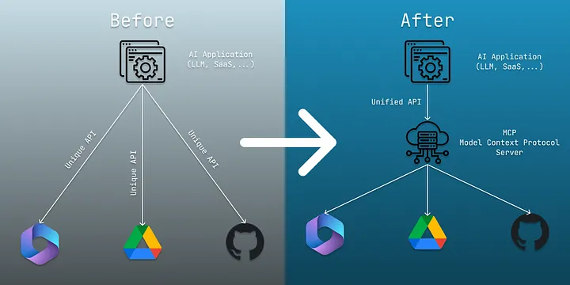

# Agentic AI

---

# Why Agentic AI

- Move from "next-token prediction" to "goal-directed behavior"
- Enable AI systems to perform complex tasks autonomously
- Break down complex problems into smaller, manageable sub-tasks

---

# Agentic AI vs AI Agents

- **AI Agents**
    - Modular systems driven and enabled by LLMs
    - Improve with tools, prompts and reasoning
- **Agentic AI**
    - Multi-agent collaboration
    - Dynamic task decomposition
    - Persistent memory
    - Coordinated autonomy.

---

# Reasoning Loop

- Agentic AI operates in a reasoning loop:
    1. **Perception**: Gather information from the environment
    2. **Reasoning**: Analyze information and make decisions
    3. **Action**: Execute actions based on decisions
    4. **Feedback**: Receive feedback from the environment to refine future actions

---

# ReAct Framework

- ReAct (Reasoning and Acting) framework combines reasoning and acting in a single loop
- Agents can reason about their actions and adjust them based on feedback

---

<!-- .slide: data-background="#fff" -->


---

# Example Task: "Plan a trip to Paris"

1. **Perception**: Gather information about Paris (weather, attractions, etc.)
2. **Reasoning**: Decide on the best time to visit, places to see, and activities to do
3. **Action**: Book flights, hotels, and create an itinerary
4. **Feedback**: Adjust plans based on new information (e.g., weather changes, attraction closures)

---

# Agentic Memory

- Episodic Memory: Task-specific information
- Semantic Memory: Long-term facts or structured data
- Vector-based Memory: RAG retrieval for relevant information

---

# Multi-Agent Systems

- Research area for a long time
- Now enabled by LLMs for better communication and coordination
- Agents can specialize in different tasks and collaborate effectively

---

# Multi-Agent Collaboration Example

- Task: "Organize a conference"
    1. **Agent 1**: Research venues and book a location
    2. **Agent 2**: Create a marketing plan and promote the event
    3. **Agent 3**: Coordinate with speakers and manage logistics
    4. **Agent 4**: Handle registrations and attendee communication

---

# Orchestration and Coordination

- Orchestration: Managing the flow of tasks and information between agents
- Coordination: Ensuring agents work together effectively to achieve a common goal
- Techniques include:
    - Task decomposition
    - Role assignment
    - Communication protocols

---

# Model Context Protocol (MCP)

- Based on "Language Server Protocol (LSP)"
- MCP is a protocol for communication between agents
- Defines a standard format for messages, including:
    - Task description
    - Agent capabilities
    - Feedback and results

---



---

# MCP Participants

- **Host**: Manages the overall system and coordinates agents
- **Client**: Program that uses tools provided by servers
- **Server**: Program that provides tools to clients

---

# JSON-RPC

- Underlying communication protocol for MCP
- Example:

```json
{
    "jsonrpc": "2.0", "method": "add", "params": [1, 2], 
    "id": 1
} 
==> 
{
    "jsonrpc": "2.0", "result": 3, "id": 1
}
```

---

# MCP Primitives

- **Tools**: Executable functions that AI applications can invoke to perform actions (e.g., file operations, API calls, database queries)
- **Resources**: Data sources that provide contextual information to AI applications (e.g., file contents, database records, API responses)
- **Prompts**: Reusable templates that help structure interactions with language models (e.g., system prompts, few-shot examples)

---

# MCP Data Layer Protocol

1. **Initialization**
    - Establish connection and exchange capabilities
2. **Tool Discovery**: 
    - Calls `tools/list` to discover available tools
3. **Tool Execution**:
    - Call `tools/call` to execute a tool with specific parameters
4. **Notifications**:
    - Servers can inform clients about changes  (e.g., new tools)

---

# MCP Examples

- **GitHub MCP**: Allows agents to search repositories, read code, create pull requests, and manage issues
- **Slack MCP**: Allows agents to monitor channels, summarize threads, or post updates on behalf of the user
- **Filesystem MCP**: Allows agents to read, write, and manage files on a local or remote filesystem

---

# Agent2Agent Protocol

- Protocol for communication between agents
- Proposed by Google Research
- Focuses on peer-to-peer communication and collaboration between agents

---

# A2A vs MCP

<span style="font-size: 0.6em">

| Feature | **Model Context Protocol (MCP)** | **Agent-to-Agent (A2A)** |
| --- | --- | --- |
| **Primary Direction** | **Vertical** (Downwards to data/tools) | **Horizontal** (Peer-to-peer with agents) |
| **Analogy** | A **USB-C port** for an LLM to plug in tools. | A **Network Protocol** (like HTTP) for agents to talk. |
| **Core Concept** | **Tools & Resources:** "Read this file," "Query this SQL DB." | **Tasks & Delegation:** "I need a specialist to summarize this." |
| **Discovery** | Static (defined in host config). | Dynamic (using **Agent Cards** to find skills). |
| **State** | Mostly stateless (request-response). | Stateful (supports long-running, async tasks). |

</span>

---

# Limitations

- **Causal Understanding**: LLMs have problems with causal reasoning; Agentic AI does not fix this
- **Limitations from LLMs**: Hallucinations, computational costs, etc.
- **Limited Autonomy**: Rely heavily on human-created prompts or heuristics
- **Reliability & Safety**: Not generally safe or reliable for real-world applications yet

---

# Challenges

- **Communication Bottlenecks**: Hard to share enough information between agents
- **Emergent Behaviour**: Can create unintended consequences or behaviors that are hard to predict
- **Scalability**: As the number of agents increases, coordination becomes more complex
- **Debugging**: Difficult to understand and debug multi-agent interactions

---

# Challenges

- **Explainability**: Hard to infer which agent is responsible for which action or decision
- **Security**: A single compromised agent can cause significant damage to the system
- **Ethical Concerns**: Potential for misuse or unintended consequences in real-world applications

---

# Summary

- Agentic AI enables goal-directed behavior and complex task execution
- Multi-agent collaboration allows for specialization and improved performance
- Protocols like MCP and A2A facilitate communication and coordination between agents

---

# Sources

https://www.dailydoseofds.com/ai-agents-crash-course-part-10-with-implementation/
https://www.descope.com/learn/post/mcp
https://www.sciencedirect.com/science/article/pii/S1566253525006712
