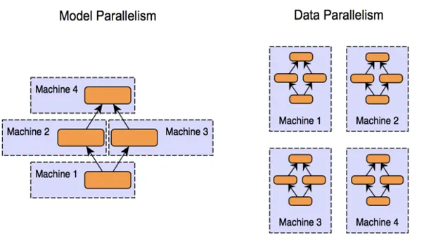
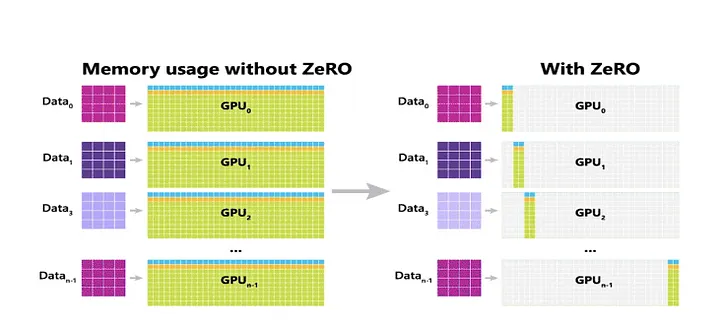
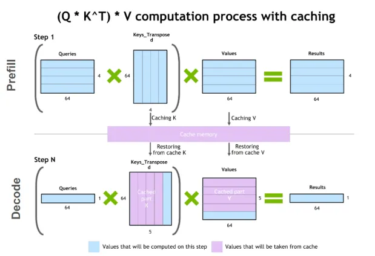
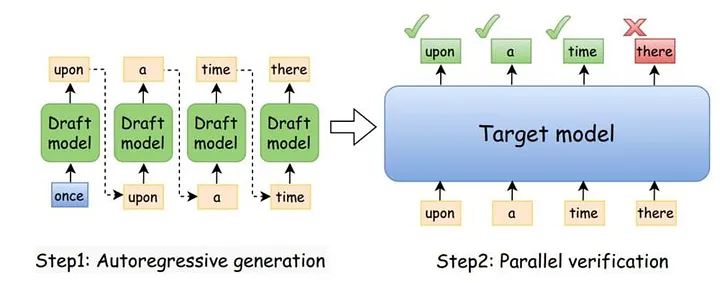

# Large-Scale LLM Development and Deployment

---

## Topics

- Parallelism
- High-throughput Inference
- Guardrails

--- 

## Why Parallelism?

- LLMs have billions of parameters, which require more memory than a single GPU can provide.
- Datasets used to train LLMs can be in the order of terabytes, which also exceeds the memory capacity of a single GPU.
- LLMs are trained on massive compute clusters with thousands of GPUs.
- Communication between GPUs is a bottleneck.

---

## Parallelism

- **Data Parallelism**: Distributing data across multiple GPUs to train the same model in parallel.
- **Model Parallelism**: Splitting the model itself across multiple GPUs to handle larger models that don't fit in a single GPU's memory.

---

## Data Parallelism

- Each GPU processes a different mini-batch of data.
- Gradients are averaged across GPUs to update the model parameters.
- Benefits: Simple to implement, effective for large datasets.

---

## Model Parallelism

- The model is divided into parts, and each part is assigned to a different GPU.
- Useful for training very large models that exceed the memory capacity of a single GPU.
- Challenges: Communication overhead between GPUs, more complex implementation.

---

<!-- .slide: data-background="#ccc" -->


---

## ZeRO

- ZeRO (Zero Redundancy Optimizer) is a technique for optimizing memory usage during training.
- ZeRO-1: Partition optimizer states across GPUs.
- ZeRO-2: Partition gradients across GPUs.
- ZeRO-3: Partition model parameters across GPUs.

---

<!-- .slide: data-background="#ccc" -->


---

## ZeRO

- ZeRO allows for training models with billions of parameters by efficiently utilizing GPU memory.
- It reduces memory redundancy and communication overhead, enabling larger batch sizes and faster training.
- But, ZeRO-3 requires fetching weights over the network, which can be slower than the high-speed "intra-layer" math of Tensor Parallelism.

---

## DP vs MP vs ZeRO

- **Standard DP**: Every student has their own copy of the entire textbook and study different chapters. (Wasteful storage).
- **Model Parallelism**: There is only one textbook. We tear the pages out and give 10 pages to each student. Students must constantly pass notes. (High overhead).
- **ZeRO**: There is only one textbook. We keep it in a shared library. Students check out and return the book as they need. They still study different subjects (data) independently.

---

## 3D Parallelism

Really large models need 3D Parallelism
- Tensor Parallelism: To split the massive layers within a single server.
- Pipeline Parallelism: To split chunks of layers across different servers.
- ZeRO (Data Parallelism): To scale the entire setup across thousands of GPUs to handle massive datasets.

---

## Chinchilla Laws

Given a fixed compute budget (e.g., 1,000 GPUs for 1 month), what is the optimal balance between model size ($N$ parameters) and the amount of training data ($D$ tokens)?

---

## Chinchilla Laws

Hoffman et al. (2022) compared:

- GPT-3 (175B): Massive model, relatively small dataset (300B tokens).
- Chinchilla (70B): Smaller model, but trained on a massive dataset (1.4T tokens).

The practical "rule of thumb" derived from the paper is that a model should be trained on roughly 20 tokens per parameter.

---

## High-throughput Inference

- LLM inference takes a lot of compute
- Users want a fast "Time To First Token" (TTFT)
- Costs of inference can be very expensive

---

## KV Caching

- **Problem**: Quadratic Inference of LLMs
- To generate the 101st token you must recalculate the $K$ and $V$ for all 100 previous tokens.
- Like re-reading the first 50 pages of a book every time you turn a new page.

---

<!-- .slide: data-background="#ccc" -->


---

## KV Caching

- **Solution**: Cache the $K$ and $V$ values for all previous tokens.
- Saves computation time, but requires more memory.

\\[
\text{Size} = 2 \times \text{\#layers} \times \text{\#heads} \times \text{head_size} \times \text{seq\_len}
\\]

---

## Speculative Decoding

- Many queries do not need the full power of a large model.
- Use a smaller model to generate a "speculation" of the next token.
- If the speculation is correct, we save time by skipping the large model inference.

---

<!-- .slide: data-background="#ccc" -->


---

## Speculative Decoding

- The smaller model generates a set of candidate tokens.
- The larger model only verifies the results of the smaller model.
- We compare the probability of the draft model $q(x)$ with the probability of the large model $p(x)$.
- We accept the draft token if $p(x) \geq q(x)$, otherwise we reject it.

---

## Speculative Decoding - Residual

- If we reject the draft token, we can sample from the residual distribution:

\\[
r(x) = \frac{max(0, p(x) - q(x))}{Z}
\\]

Where $Z$ is a normalization constant to ensure $r(x)$ is a valid probability distribution.

---

## Guardrails

- "Keyword filters" can filter words or phrases, but they are easy to bypass and can lead to false positives.

<span style="font-size:0.6em">

| Category | Objective | Example |
|----------|-----------|---------|
| Topical Rails | Ensure the model stays on-domain. | A banking bot refusing to discuss recipes. |
| Safety Rails | Prevent harm or illegal content. | Blocking instructions on how to build a bomb. |
| Security Rails | Prevent adversarial attacks. | Detecting "Prompt Injections" or "Jailbreaks." |
| Factuality Rails | Reduce hallucinations. | Checking if a claim is grounded in a specific PDF. |
| Formatting Rails | Enforce structured output. | Ensuring the LLM only outputs valid JSON. |

</span>

---

## Guardrails

- LLM-as-Judge can implement guardrails by using the LLM itself to evaluate the output of another LLM.
- Penalty on TTFT as the LLM must generate multiple tokens to evaluate the output of another LLM.


---

## NeMo Guardrails

- NeMo Guardrails is an open-source framework for building guardrails using LLMs.
- Allows bot to refuse certain topics, detect adversarial attacks, and ensure factuality.
- Developed by NVIDIA, it provides a flexible and customizable way to implement guardrails in LLM applications.

---

## NeMo Examples

```
define user ask about politics
  "What do you think about the election?"

define bot refuse to talk politics
  "I am a CloudScale support assistant. 
   I am not programmed to discuss politics."

define flow politics
  user ask about politics
  bot refuse to talk politics
  bot offer help
```

---

# Conclusion

- Training and deploying large-scale LLMs requires careful consideration of 
    - parallelism techniques,
    - inference optimizations,
    - guardrails.

---

### Sources

https://oracle-oci-ocas.medium.com/zero-redundancy-optimizers-a-method-for-training-machine-learning-models-with-billion-parameter-472e8f4e7a5b

https://developer.nvidia.com/blog/mastering-llm-techniques-inference-optimization/

https://medium.com/@genai.works/speed-up-llm-inference-with-speculative-decoding-1fc79701e9d6
